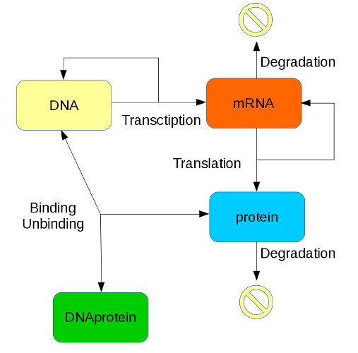
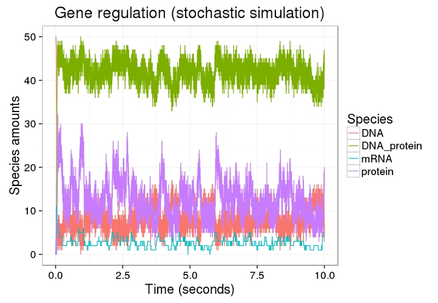
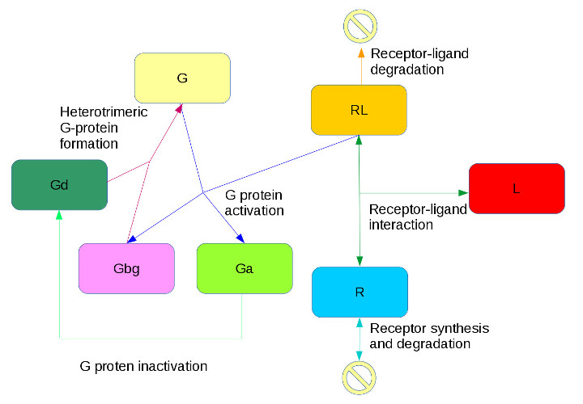
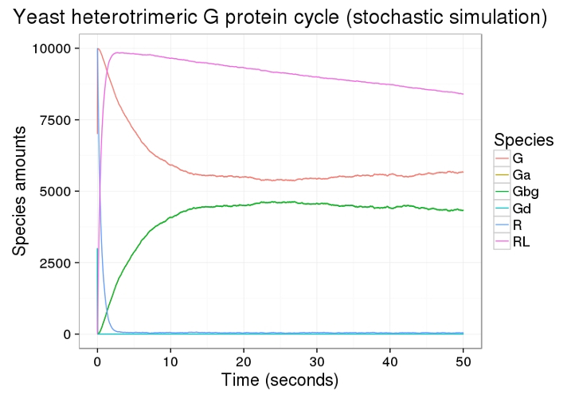
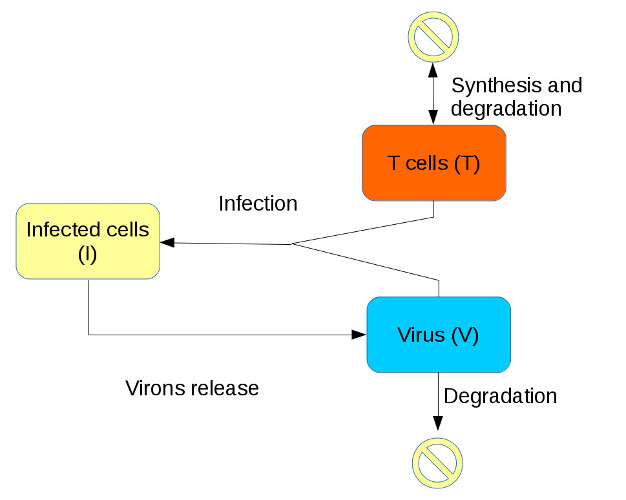
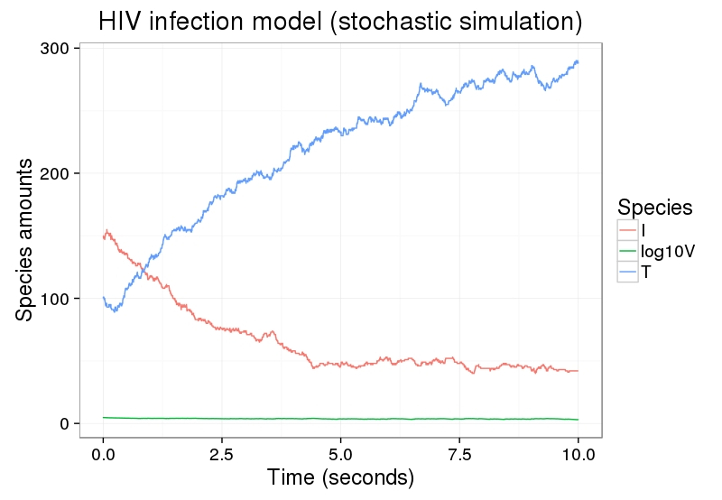
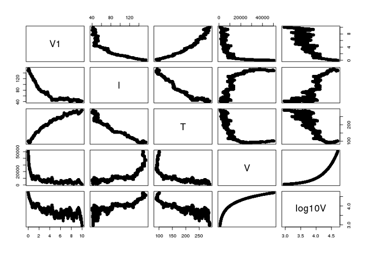
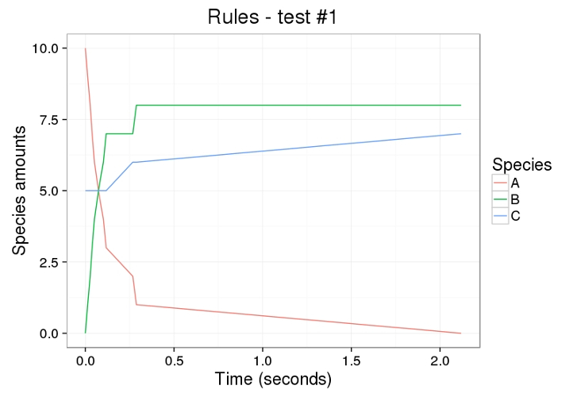

`sysBio` is an open source package for modeling and simulation of biological systems. It provides ability to convert reactions into ordinary differential equations (ODEs) and ability to solve them via numerical integration.

To install the `sysBio` package, run the following command:

```{r}
#library("devtools")
#install_github("Vessy/sysBio")
library("sysBio")
```

For more details about current features, future plans, and main functionalities, see ['sysBio Wiki'] (https://github.com/Vessy/sysBio/wiki) at the 'sysBio' GitHub project.

To report a bug, a problem, or have a suggestion, please raise an issue in the [`sysBio`](https://github.com/Vessy/sysBio) GitHub project.

## Examples

### Example 1: Synthesis - Zero order reaction

In the zero order reactions, the reaction rate is independent of the reactant concentration and it equals the reaction rate. Thus, in the process of synthesis, species are added to the system at a rate that equals the reaction rate. We model the synthesis reaction of species _P_ (with the reaction rate _k=1_) as null -> P.

In 'sysBio', we will first create a new model called Synthesis:

```{r}
# Synthesis - Zero order reaction
exmp1 <- newModel("Synthesis")
```

Then, we will add a reaction to the model. We will name this reaction _Synthesis of P_:

```{r}
addMAreaction(exmp1, "null  -> P", "k", name = "Synthesis of P")
```

Next, we will define species and reaction rate. Reaction rate is constant, so we will use type _fixed_:

```{r}
addSpecies(exmp1, "P", 0)
addMAreactRate(exmp1, "k", "fixed", 1)
```

Now we can make a mathematical representation of the model, with the _makeModel_ command:

```{r}
makeModel(exmp1)
```

To simulate the model, we use the _simulateModel_ command:

```{r}
simResults <-simulateModel(exmp1)
```

Simulation of the model produces the following result:

```{r, fig.show='hold', fig.width = 7, fig.height = 7 }
plotResults(simResults, title="Synthesis")
```

The simulation shows a clear linear trend in amount of species are added to the system and the rate _k=1_.


### Example 2: Degradation

Assumption: species _P_, that are found in the system in the amount of 10 units, are degraded at a rate _r_, where _r=0.1*P_.

In 'sisBio', we can model this process similarly to the process of synthesis:

```{r}
# Degradation
exmp2 <- newModel("Degradation")
addMAreaction(exmp2, "P -> null", "r", name = "Degradation of P")
addMAreactRate(exmp2, "r", type="assigned", val="k*P")
addSpecies(exmp2, "P", 10)
addParameters(exmp2, "k", 0.1)
makeModel(exmp2)
simResults <-simulateModel(exmp2)
```

Simulation of the model produces the following result:

```{r, fig.show='hold', fig.width = 7, fig.height = 7}
plotResults(simResults, title="Degradation")
```


### Example 3: Gene regulation model

Gene regulation model is a bit more complex model, as gene regulation process can be described by six reactions: transcription, translation, binding, unbinding, mRNA degradation, and protein degradation. Additionally, reaction rates involved in this process are not constant, but depend on the species amounts. 

Rreactions and parameters definitions are taken from  [http://www.mathworks.com/help/simbio/gs/-model-a-gene-regulation-pathway.html](http://www.mathworks.com/help/simbio/gs/-model-a-gene-regulation-pathway.html)):



First, we will create a new model for this process and add the reaction that describe this process into the model:

```{r}
# Gene regulation
exmp3 <- newModel("Gene Regulation")

addMAreaction(exmp3, "DNA -> DNA + mRNA", r1="v1", name="Transcription")
addMAreaction(exmp3, "mRNA -> mRNA + protein", r1="v2", name="Translation")
addMAreaction(exmp3, "DNA + protein -> DNA_protein", r1="v3", name="Binding")
addMAreaction(exmp3, "DNA_protein -> DNA + protein", r1="v4", name="Unbinding")
addMAreaction(exmp3, "mRNA -> null", r1="v5", name="Degradation: mRNA")
addMAreaction(exmp3, "protein -> null", r1="v6", name="Degradation:protein")
```    
    
Next, we will define reaction rates. All reaction rates in this model are species depended (thus, not constant), so we have to specify their type as _assigned_:

```{r}    
addMAreactRate(exmp3, "v1", "assigned", "k1*DNA")
addMAreactRate(exmp3, "v2", "assigned", "k2*mRNA")
addMAreactRate(exmp3, "v3", "assigned", "k3*DNA*protein")
addMAreactRate(exmp3, "v4", "assigned", "k3r*DNA_protein")
addMAreactRate(exmp3, "v5", "assigned", "k4*mRNA")
addMAreactRate(exmp3, "v6", "assigned", "k5*protein")
```  
    
Now, we can add species initial values and parameters values (all of which are constant):    
    
```{r}    
addSpecies(exmp3, "DNA", 50)
addSpecies(exmp3, "mRNA", 0)
addSpecies(exmp3, "protein", 0)
addSpecies(exmp3, "DNA_protein", 0)

addParameters(exmp3, "k1", 0.2)
addParameters(exmp3, "k2", 20)
addParameters(exmp3, "k3", 0.2)
addParameters(exmp3, "k3r", 1)
addParameters(exmp3, "k4", 1.5)
addParameters(exmp3, "k5", 1)
```    
    
To see if everything within the model is defined, you can use the _validateModel_ command:
    
```{r}    
validateModel(exmp3)
```

Finally, we build our model:

```{r}
makeModel(exmp3)
```

To see a high-level info about the model, use the _printInfo_ command:

```{r}    
printInfo(exmp3)
```

To see more details about the model, use either

```{r eval=FALSE}
printInfo(exmp3, allDetails=TRUE)
```

or just

```{r eval=FALSE}
exmp3
```

command. 

Once the model is built, we can run a simulation:

```{r}
simResults <-simulateModel(exmp3)
```

Simulation of the model produces the following result:

```{r, fig.show='hold', fig.width = 7, fig.height = 7 }
plotResults(simResults, title="Gene regulation")
```

We can also run a stochastic simulation:

```{r eval=FALSE}
# Stochastic simulation
simResults.stoch <- solveStoch(exmp3,10)
```

Stochastic simulation of the model produces the following result:

```{r, fig.show='hold', fig.width = 7, fig.height = 7, eval=FALSE}
plotResults(simResults.stoch, title="Gene regulation (stochastic simulation)")
```



### Example 4: Yeast heterotrimeric G protein cycle

Yeast heterotrimeric G protein cycle can be described by six reactions: receptor-ligand interaction, heterotrimeric G-protein formation, G protein activation, receptor synthesis and degradation, receprot-ligand degradation, and G proten inactivation (reactions and parameters definitions are taken from http://www.mathworks.com/help/simbio/ug/model-of-the-yeast-heterotrimeric-g-protein-cycle.html):



We create a new model for this process and add the reaction that describe this process into the model. Some of the reactions in this model are reversible and for those reactions we need to specify forward and reverse reaction rates:

```{r}
# Yeast heterotrimeric G protein cycle
exmp4 <- newModel("Yeast heterotrimeric G protein cycle")

addMAreaction(exmp4, "L + R = RL", r1="kRL", r2="kRLm", name="Receptor-ligand interaction")
addMAreaction(exmp4, "Gd + Gbg -> G", r1="kG1", name="Heterotrimeric G-protein formation")
addMAreaction(exmp4, "RL + G -> Ga + Gbg + RL", r1="kGa", name="G protein activation")
addMAreaction(exmp4, "R = null", r1="kRdo", r2="kRs", name="Receptor synthesis and degradation")
addMAreaction(exmp4, "RL -> null", r1="kRD1", name="Receprot-ligand degradation")
addMAreaction(exmp4, "Ga -> Gd", r1="kGd", name="G proten inactivation")
```     

Next, we add initial species amounts and reaction rate values (all constant in this case):

```{r}        
addSpecies(exmp4, "L", 6.022E+017)
addSpecies(exmp4, "R", 10000.0)
addSpecies(exmp4, "RL", 0.0)
addSpecies(exmp4, "Gd", 3000)
addSpecies(exmp4, "Gbg", 3000)
addSpecies(exmp4, "G", 7000)
addSpecies(exmp4, "Ga", 0.0)

addMAreactRate(exmp4, "kRL", "fixed", 3.32E-18)
addMAreactRate(exmp4, "kRLm", "fixed", 0.01)
addMAreactRate(exmp4, "kG1", "fixed", 1.0)
addMAreactRate(exmp4, "kGa", "fixed", 1.0E-5)
addMAreactRate(exmp4, "kRdo", "fixed", 4.0E-4)
addMAreactRate(exmp4, "kRs", "fixed", 4.0)
addMAreactRate(exmp4, "kRD1", "fixed", 0.0040)
addMAreactRate(exmp4, "kGd", "fixed", 0.11)
``` 

Now we can build and simulate our mode;""

```{r}    
#validateModel(exmp4)

makeModel(exmp4)

#printInfo(exmp4)

simResults <-simulateModel(exmp4, times=seq(0, 50, by = 0.5))
```    

Simulation of the model produces the following result:

```{r, fig.show='hold', fig.width = 7, fig.height = 7}
# Plot results, but skip L, because value is too hight
plotResults(simResults[,c(1, 3:8)], title="Yeast heterotrimeric G protein cycle")
```

We can also run a stochastic simulation of the model:

```{r eval=FALSE}
# Stochastic simulation
simResults.stoch <- solveStoch(exmp4, 50)
```

Stochastic simulation of the model produces the following result:

```{r, fig.show='hold', fig.width = 7, fig.height = 7, eval=FALSE}
# Plot results, but skip L, because value is too high
plotResults(simResults.stoch[,c(1:5, 7:8)], title="Yeast heterotrimeric G protein cycle (stochastic simulation)")
```





*****
### Example 5: HIV infection model

Another biological process we will model is HIV infection. This model can be described by four reactions: T cells synthesis and degradation, virons degradation, virons release, and cell infection (reactions and parameters definitions are taken from https://cran.r-project.org/web/packages/FME/vignettes/FME.pdf): 



As before, we first create a new model, add reactions, species, and reaction rates. Then we build a model and simulate the process:

```{r}
exmp5 <- newModel("HIV infection model")

addMAreaction(exmp5, "null = T", "l", 'r')
addMAreaction(exmp5, "V -> null", "c")
addMAreaction(exmp5, "T + V-> I", "b")
addMAreaction(exmp5, "I -> 900*V", "d")

addSpecies(exmp5, "T", 100)
addSpecies(exmp5, "V", 50000)
addSpecies(exmp5, "I", 150)

addMAreactRate(exmp5, "l", "fixed", 80)
addMAreactRate(exmp5, "b", "fixed", 0.00002)
addMAreactRate(exmp5, "r", "fixed", 0.15)
addMAreactRate(exmp5, "d", "fixed", 0.55)
addMAreactRate(exmp5, "c", "fixed", 5.5)

makeModel(exmp5)

#printInfo(exmp5)

simResults <- simulateModel(exmp5)
simResults <- cbind(simResults, log10V=log10(simResults$V))
```    

Simulation of the model produces the following result:

```{r, fig.show='hold', fig.width = 7, fig.height = 7 }
plotResults(simResults[,c("time", "T", "I", "log10V")], title="HIV infection model")
```

We can also plot all species vs all species

```{r, fig.show='hold', fig.width = 7, fig.height = 7 }
plot(simResults)
```

We can compare these results to the results of stochastic simulation:

```{r eval=FALSE}
# Stochastic simulation
simResults.stoch <- solveStoch(exmp5, 10)
simResults.stoch <-  cbind(simResults.stoch, log10V=log10(simResults.stoch$V))
```    

Stochastic simulation of the model produces the following result:

```{r, fig.show='hold', fig.width = 7, fig.height = 7, eval=FALSE}
plotResults(simResults.stoch[,c("V1", "T", "I", "log10V")], title="HIV infection model (stochastic simulation)")
```



We can also plot all species vs all species for the stochastic simulation results:

```{r, fig.show='hold', fig.width = 7, fig.height = 7, eval=FALSE}
plot(simResults.stoch)
```




*****
### Example 6: Rules

Finally, we will show how to use rules. In general, rules are used to specify values for model species based on the values of other components in the model. 'sysBio' right now uses only ODEs type of rules. The model used in this example has no biological background.

```{r eval=FALSE}    
# Rules - test
exmp6 <- newModel("Rules")

addMAreaction(exmp6, "A -> B", r1="m")

addSpecies(exmp6, "A", 10)
addSpecies(exmp6, "B", 0)
addSpecies(exmp6, "C", 5)

addMAreactRate(exmp6, "m", "assigned", "k1*A")

addParameters(exmp6, "k1", 1)
addParameters(exmp6, "k2", 1)

addRule(exmp6, "rule1", "ODEs", "C=k2*A")

#validateModel(exmp6)

makeModel(exmp6)

#printInfo(exmp6)

simResults <-simulateModel(exmp6) 

simResults.stoch <- solveStoch(exmp6)
```

Simulation of the model produces the following result:

```{r, fig.show='hold', fig.width = 7, fig.height = 7, eval=FALSE}
plotResults(simResults, title="Rules")
```

And the stochastic simulation of the model produces the following result:

```{r, fig.show='hold', fig.width = 7, fig.height = 7, eval=FALSE}
plotResults(simResults.stoch, title="Rules")
```


